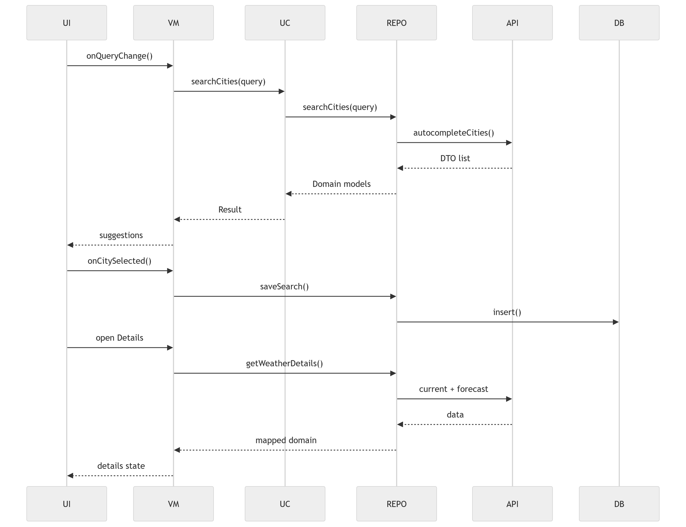
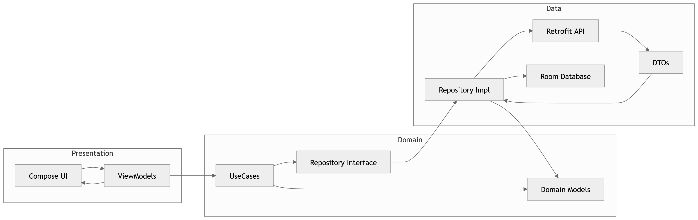

# Weather App ☁️🌡️

Android weather application built with modern Android stack and clean architecture.  
Focus: **correct state management, scalable architecture, and production-ready patterns**.

---

## ✨ Features

- 🔍 City search with regex validation  
- 📍 Autocomplete suggestions (AccuWeather API)  
- 📊 Weather details (current + 5-day forecast)  
- 🎨 Temperature-based color system  
- 🕘 Search history persisted with Room  
- ⚡ Reactive UI (StateFlow + Compose)  
- 📱 Android 6+ support  

---

## 🧱 Tech Stack

- **Kotlin**
- **Jetpack Compose**
- **Hilt (DI)**
- **Retrofit + Moshi**
- **Room**
- **Coroutines + Flow**
- **Navigation Compose**

---

## 🏗️ Architecture

- Clean Architecture (Presentation / Domain / Data)
- MVVM + unidirectional data flow
- Repository pattern
- Stateless UI + state hoisted to ViewModel

---

## 🔄 Data Flow



## 🧩 Layers



## 📂 Project Structure

```text
presentation/
 ├── search/
 ├── details/
 ├── navigation/

domain/
 ├── model/
 ├── repository/
 ├── usecase/

data/
 ├── remote/
 ├── local/
 ├── repository/

di/
```

## ⚙️ Setup

1. Get API key from AccuWeather  
2. Add to `local.properties`:

```properties
ACCUWEATHER_API_KEY=your_key
```

3. Sync & run

## 🧪 Testing

- Unit tests (UseCases, ViewModels, Repository)  
- UI tests (Compose)  
- Flow testing with Turbine  
- Coroutine testing with TestDispatcher  

**Focus:**
- validation logic  
- state transitions  
- error handling  

---

## 🚧 Key Decisions

- No business logic in Composables  
- ViewModel is single source of truth  
- Repository abstracts API + DB  
- Regex validation before API call  
- Stateless UI for testability  

---

## 📈 Future Improvements

- Offline caching for weather data  
- Pagination for search results  
- Better error mapping (network vs validation)  
- Theming (dark mode, dynamic colors)  
- Weather icons mapping  

---

## 🧠 Purpose of this project

This is not a demo-only CRUD app.  
It demonstrates:

- real-world architecture  
- correct state handling  
- separation of concerns  
- testable codebase  

---

## 📜 License

MIT
